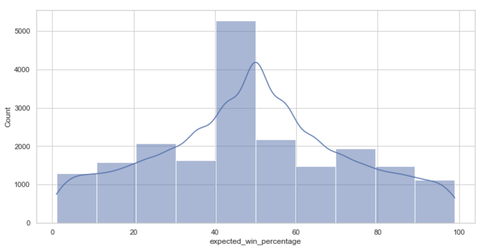
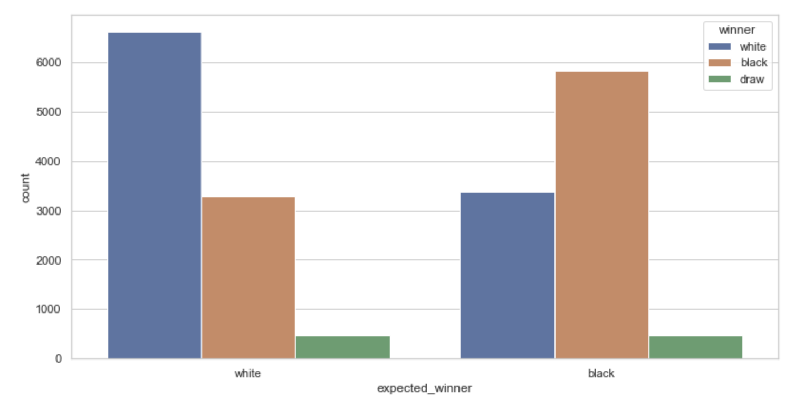
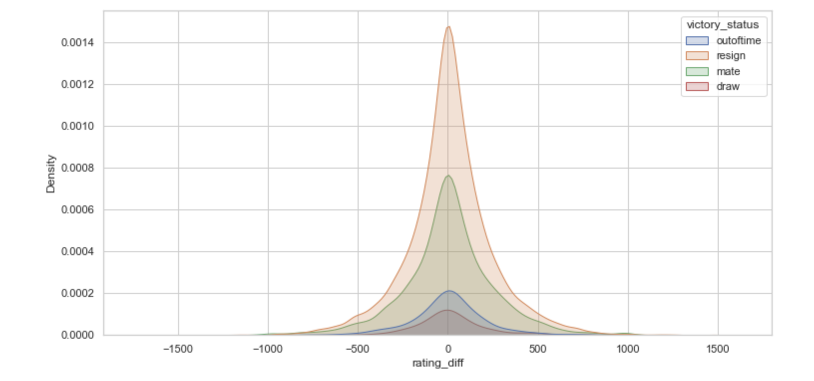
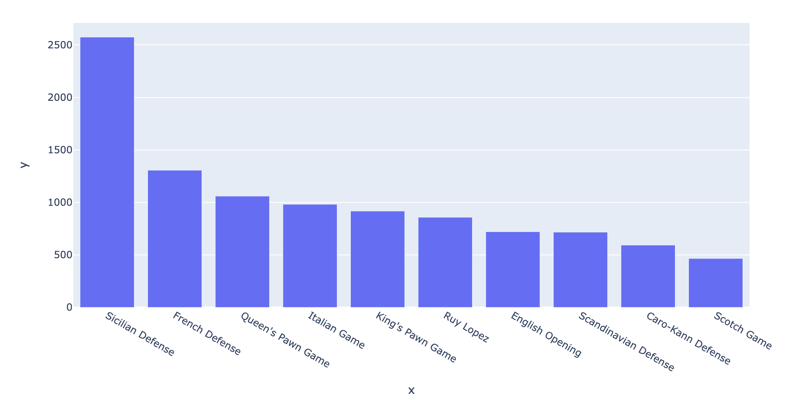
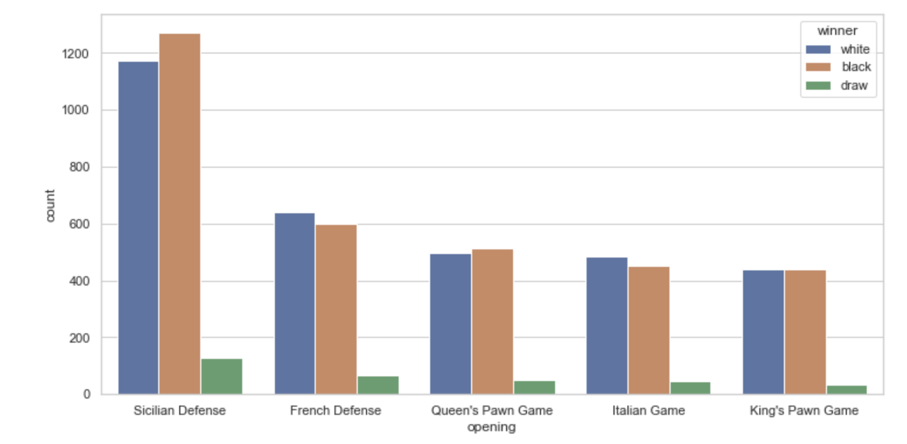
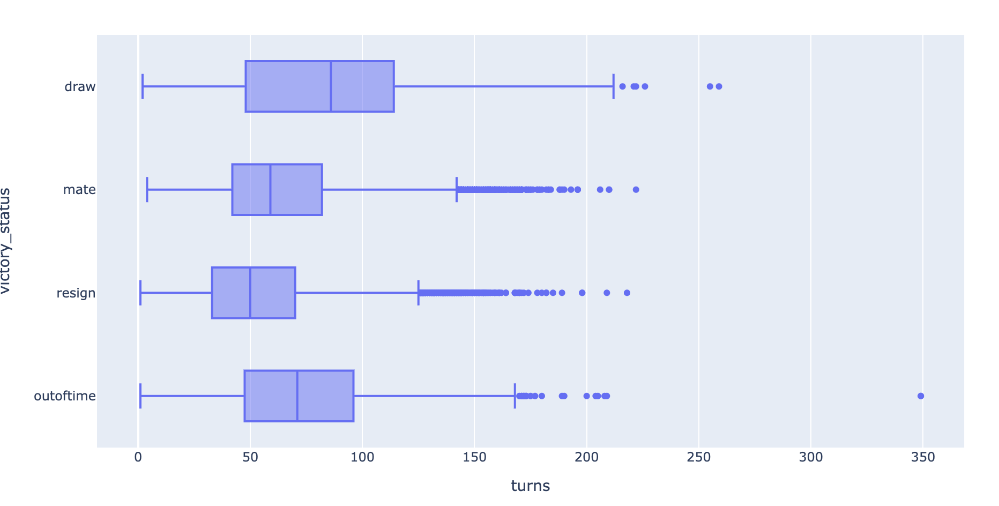

# Project 2

### Goals
The Goal for this project is to analyze the database for chess games through web scraping in order to create a new hypotesis through visualization graphics.

### Hypothesis

The hypothesis I would like to present is that the statistics are usually taken from high ranking players (mean of turns, expected win percentage, expected winner (white or black) and the most used openings) and to finish, the statistics of a normal player (between 1000-1600 elo) will be quite different.

Aditonally, I aim to prove that winning at online chess the most common outcome for victory status is by the resigning of the opponent player.

### Cleansing and Web Scraping

Cleaning and Scraping proces is contained in the juppiter notebooks.

I started by cleansing the database which was pretty clean, then removing some columns of not use and creating a new ones with standarized values.

Also scrapped chess information that I found in internet to complement my csv.

To end it I merged everything in 1 data frame then you will be able to work better with the visualization process.

### Analysis
In order to prove my inicial hypothesis, at the beginning of the document we made used of some graphics to help us make some conclusions.

#### win % based on elo difference

To clarify all percentages below 50%, the chance of winning is favorable to white and higher than 50% its favorable to black.
As expected 40%-50% are the biggest values due to the fact that online chess try to match players with similiar elo or at least around the same level.

#### expected winner vs real winner

It is assumed that a player with a higher ranking would usually have to beat a lower ranked player, in the graph we can see who was expected to win and who actually won.

#### victory status compared with elo difference

As we can see the victory status is more habitual by resign, that is because in chess you can resing since the first turn. What's more, we can observe that the greater the difference in ratings is between the players, the number of resigns decreases.

#### Most used openings 

Looking at the openig graph several conclusions can be drawn,sicilian defense is the most used opening in this database, or othe conclusion can be is the opening most people like.

#### Average turns by victory status

The graph shows how draw games out of time tend to have a higher average number of moves due to their longer duration

### Conclusion

 First of all, some people who make web pages should sign up for the Ironhack bootcamp.
Regarding my initial hypotheses we can say that resign is the win status with more occurrences, also stats from this player are a bit different from the general ones, which as we said usually take into account high elo players.

